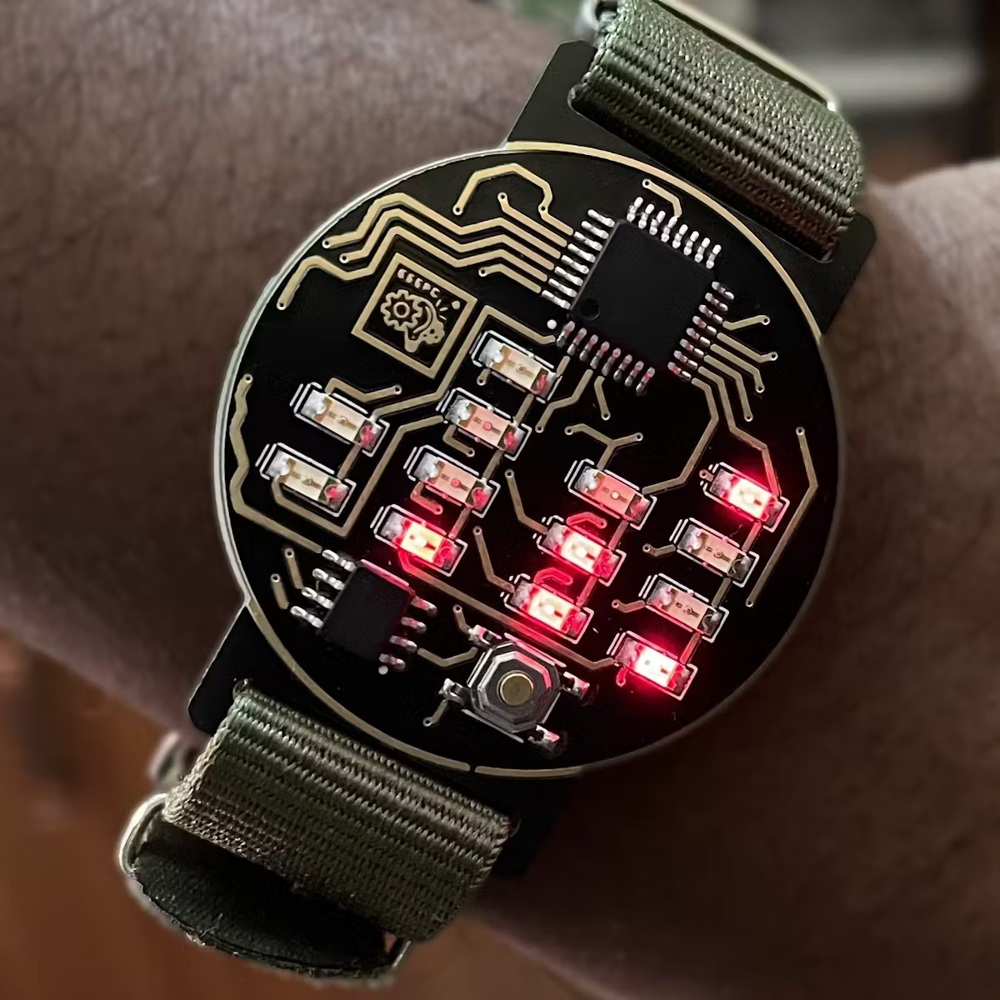
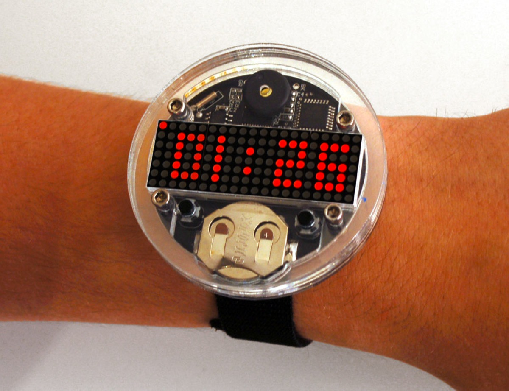
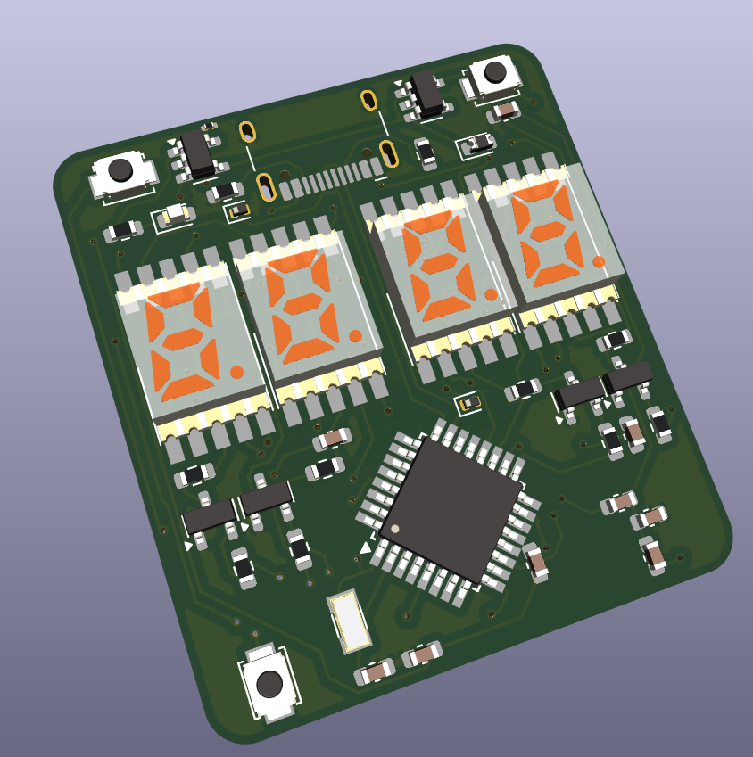
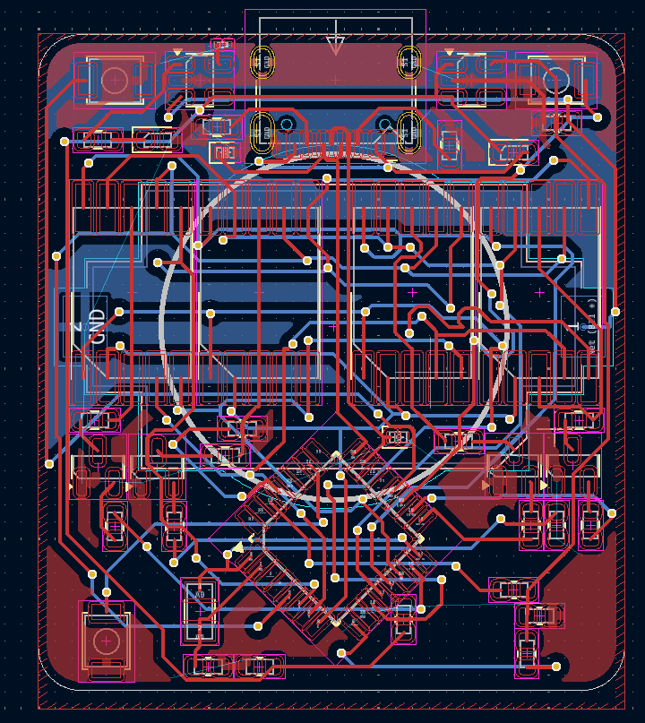
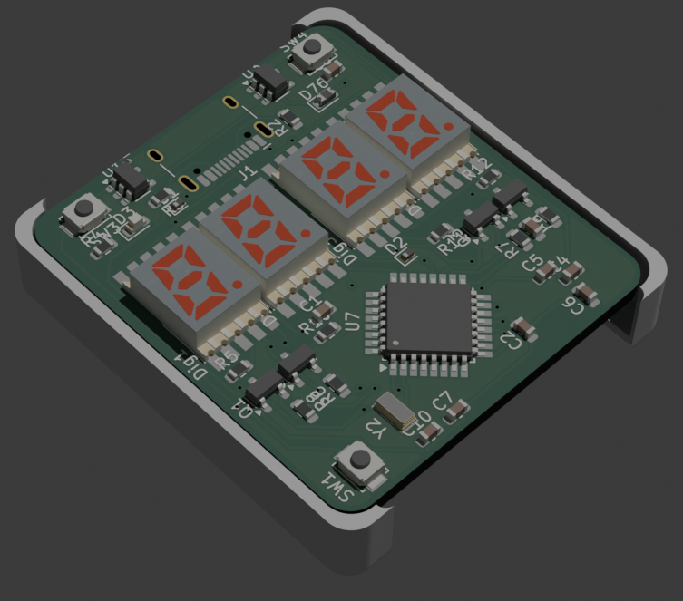
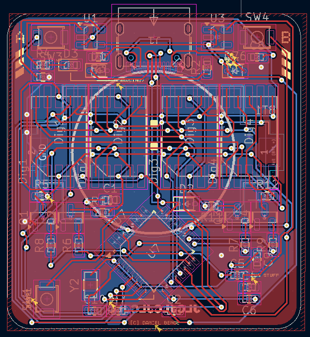
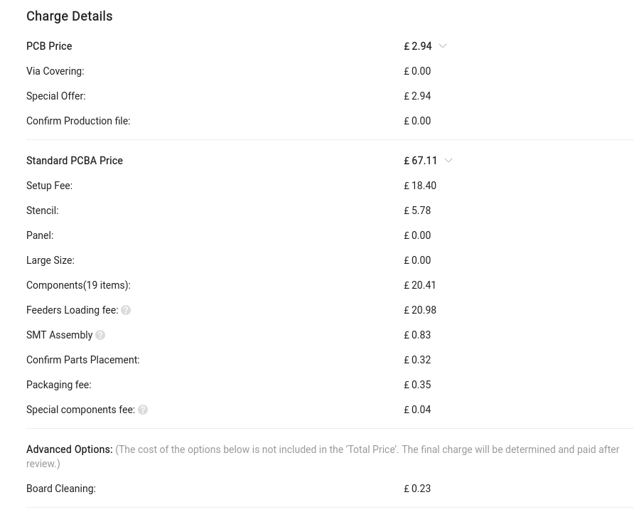

# CFWatch Development Journal

## Session 1

**And so it begins!** The goal here is to build a watch I'd genuinely be happy to wear daily, with non-intrusive charging circuitry and decent battery life. I've been loving the posts in [r/cassettefuturism](https://reddit.com/r/cassettefuturism/top/?sort=top&t=all) lately, so something fitting that vibe would just be awesome to build! I'm leaning towards 7 segment displays rather than one of those cheap 0.96" oleds or a round LCD/TFT display, simply because in my opinion they look a lot less cheap and can convey what I need them to easily. I think the main challenges here are going to be durability, making something that doesn't cost a fortune to assemble, and driving displays from a microcontroller. Here are my current ideas:
- Something like the KCSC02-105 for a surface-mounted 7 segment display
- Possibly a nRF or SAMD21 microcontroller for low power usage
- A LIR2032 rechargeable button cell for the battery seeing as the CR2032 in the same form factor is super popular and has a lot of mountings available

Here are some designs that inspired me:

I've created a schematic in this session that I'm fairly certain is a good starting point, but it is definitely subject to change a lot! I included:
1. A battery and charging circuit using the *MCP73831-2-OT*
2. A USB C port with the appropriate resistors for 5V input
3. A 5V-3.3V step down with the *AP2112K-3.3* (the SAMD21 uses 3.3V)
4. 4x 7 segment digits with transistors to select which digit is active - hopefully I'll be able to [charlieplex](https://en.wikipedia.org/wiki/Charlieplexing) them!

I've made a significant chunk of progress in this first session, but a lot will be changing as I learn more about how to design a project like this!

*(session duration: ~6hrs!)*

## Session 2

It's time for laying out the PCB! I once attempted to make a PCB watch before, but it ended up being very expensive to order from JLCPCB because it required double sided assembly, so this time I wanted to keep everything but the battery on the front. Here's what I ended up with:

And prepare yourself for autorouter torture!

I also changed quite a bit in the schematic; first of all I switched the resistors for the displays to be in series with the common anode rather than for each segment, gaining me valuable board space. I have the SAMD21 at 45 degrees to make it easier to route and also fit on the watch (which ended up being about 35x40mm in this revision)

*(session duration: ~4 hrs)*

## Session 3

What's one important thing this watch is missing? Probably a case! I've been putting this off since I'm completely new to CAD, but this is a great time for me to learn. Initially I tried OnShape before quickly learning I did not enjoy using it at all, and switched over to FreeCAD, which when it isn't randomly crashing is an excellent piece of open source software! Getting the hang of constraints wasn't very easy, but once I got my head around it they did make quite a lot of sense. I also exported a `.wrl` of my PCB from KiCad and a STL from FreeCAD to check they fitted together, I've added a render below:

This was really interesting to play around with, and I learned a ton about CAD in the process! The main issue I faced was with the battery cell - almost every mount for a CR2032 cell (I'll be using a compatible but rechargeable LIR2032) was at least 4.5mm tall, which makes it difficult to design a case without it being super tall.

*(session duration: honestly I split this into a few sections and completely lost track. Maybe 6 hours total?)*

## Session 4

This session was mostly focussed on cleaning up the watch and readying it for production. I did this in about 3 sessions in reality, but since they were all pretty similar I'll write it up in one. Enough preamble, let's get into it!
The first thing I did was to get some sensible footprints assigned. Turns out, using 0603 for everything was a stupid decision - especially for diodes. I did have to use small footprints for nearly everything, since 4x4cm is pretty tiny in the grand scheme of things
Next was routing vias... turns out, autorouter sucks, especially with such a tiny board. I routed it all by hand which led to something a bit like this:

The main issues was that the 7 segment displays made it really hard to route anything near them since they hard 10 pins each. I had to increase the board size by a few mm too, just to make enough room for traces near the edges, and I added the JLCPCB order placeholder on the back too. The main reason everything was so difficult to lay out was that to stay under my $150 budget, I had to keep everything on one side of the board to save the $50 fee JLCPCB adds for double sided assembly (which is fair enough really, I can't imagine it's easy to do with a pick and place machine)

With that done, I moved on to the case - since I changed the board shape I needed to update the 3d model. I increased the size a little, and rounded the corners more to make it much more aesthetically pleasing/

Okay, almost done now! I uploaded this draft of the design to JLC to get a rough estimate of the cost, and it came out to about £70 as shown below. Personally I think that's a pretty amazing price when you consider how difficult assembling something like this can be!

I also made a blender render of the current state:

*(session duration: roughly 8 hours in total, maybe more)*