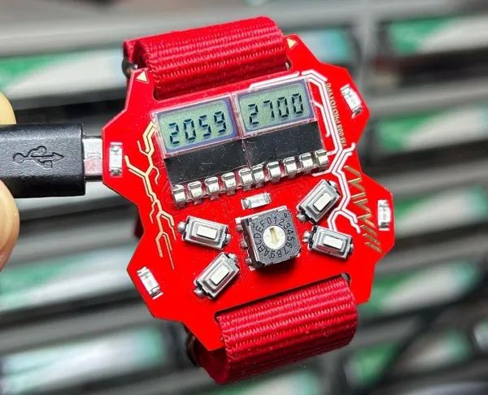

# CFWatch Development Journal

## Day 1

**And so it begins!** The goal here is to build a watch I'd genuinely be happy to wear daily, with non-intrusive charging circuitry and decent battery life. I've been loving the posts in [r/cassettefuturism](https://reddit.com/r/cassettefuturism/top/?sort=top&t=all) lately, so something fitting that vibe would just be awesome to build! I'm leaning towards 7 segment displays rather than one of those cheap 0.96" oleds or a round LCD/TFT display, simply because in my opinion they look a lot less cheap and can convey what I need them to easily. I think the main challenges here are going to be durability, making something that doesn't cost a fortune to assemble, and driving displays from a microcontroller. Here are my current ideas:
- Something like the KCSC02-105 for a surface-mounted 7 segment display
- Possibly a nRF or SAMD21 microcontroller for low power usage
- A LIR2032 rechargeable button cell for the battery seeing as the CR2032 in the same form factor is super popular and has a lot of mountings available

Here are some designs that inspired me:

I've created a schematic in this session that I'm fairly certain is a good starting point, but it is definitely subject to change a lot! I included:
1. A battery and charging circuit using the *MCP73831-2-OT*
2. A USB C port with the appropriate resistors for 5V input
3. A 5V-3.3V step down with the *AP2112K-3.3* (the SAMD21 uses 3.3V)
4. 4x 7 segment digits with transistors to select which digit is active - hopefully I'll be able to [charlieplex](https://en.wikipedia.org/wiki/Charlieplexing) them!

I've made a significant chunk of progress in this first session, but a lot will be changing as I learn more about how to design a project like this!