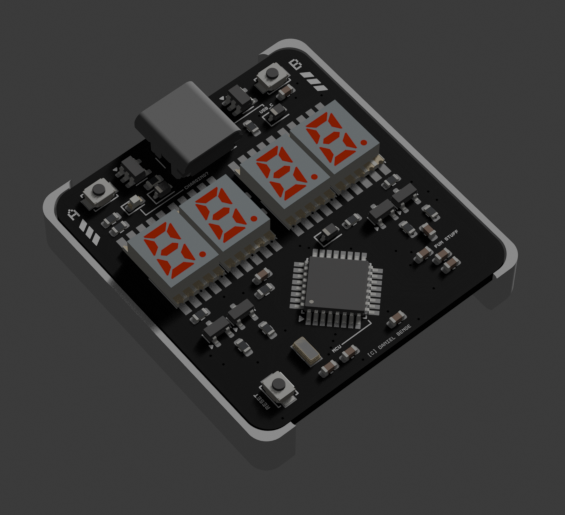

# ⌚ CFWatch
> CFWatch is a project build for Hack Club's [highway](https://highway.hackclub.com/) program! Please read `JOURNAL.md` for the current development log :)

## What is this?

CFWatch is a project that I've been wanting to build for years now. I've always dreamed of building a watch, but was never quite sure where to start - sure, the pinetime and other hackable watches were really cool, but they never quite felt "personal" or quite reflective of the stuff I enjoy. Eventually I decided I'd just build my own, but I didn't really have the knowledge or skills to do so until very recently, so when [highway](https://highway.hackclub.com/) came along I decided it was finally time! The "CF" in "CFWatch" came from [r/cassettefuturism](https://old.reddit.com/r/cassettefuturism/top/?sort=top&t=all), a huge source of design inspiration for this

## Hardware Overview (Bill of Material)

| Description | Count |
| -------- | ------- |
| USB-C charging & programming (requires bootloader) | 1 |
| red 7-segment displays | 4 |
| individually programmable buttons | 2 |
| LIR2032 battery with theoretical battery life of several months (untested) | 1 |
| SAMD21 microcontroller for low power usage | 1 |

The board layout is optimised for being assembled with JLCPCB's PCBA service, with every component apart from the battery on the front of the PCB. I would recommend hand soldering the cell mount to save costs.

## Repository Layout

The repo is structured as follows:
- PCB-related KiCad files in the `PCB/`
- FreeCAD case design in `CAD/`
- Files for creating the cover render in `Blender/`
- For a rough BOM, see `BOM.csv`
- For my development log, see `JOURNAL.md

> [!CAUTION]
> The current hardware revision has not been ordered and tested yet! Make sure you check the schematics and layout carefully before ordering it yourself, as I'm very new to designing things like this! There is no software available yet, I will write a barebones application for it once I receive my own.