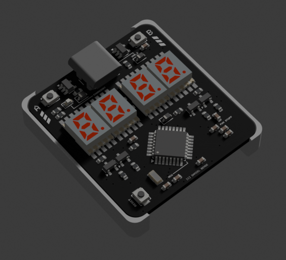

# ⌚ CFWatch

## What is this?

CFWatch is a project that I've been wanting to build for years now. I've always dreamed of building a watch, but was never quite sure where to start - sure, the pinetime and other hackable watches were really cool, but they never quite felt "personal" or quite reflective of the stuff I enjoy. Eventually I decided I'd just build my own, but I didn't really have the knowledge or skills to do so until very recently, so when [highway](https://highway.hackclub.com/) came along I decided it was finally time! The "CF" in "CFWatch" came from [r/cassettefuturism](https://old.reddit.com/r/cassettefuturism/top/?sort=top&t=all), a huge source of design inspiration for this

## Hardware Overview

The current revision has:
- USB-C charging & programming (requires bootloader)
- 4x red 7-segment displays
- 2x individually programmable buttons
- LIR2032 battery with theoretical battery life of several months (untested)
- SAMD21 microcontroller for low power usage

The board layout is optimised for being assembled with JLCPCB's PCBA service, with every component apart from the battery on the front of the PCB. I would recommend hand soldering the cell mount to save costs.

## Repository Layout

The repo is structured as follows:
- PCB-related KiCad files in the `PCB/`
- FreeCAD case design in `CAD/`
- Files for creating the cover render in `Blender/`
- For a rough BOM, see `BOM.csv`
- For my development log, see `JOURNAL.md

> [!CAUTION]
> Version 1 has SEVERAL known issues! If you plan to use this to have your own manufactured, please use the V2 design made in EasyEDA and double check everything in the schematic and PCB; I am not responsible for any non-functional boards!